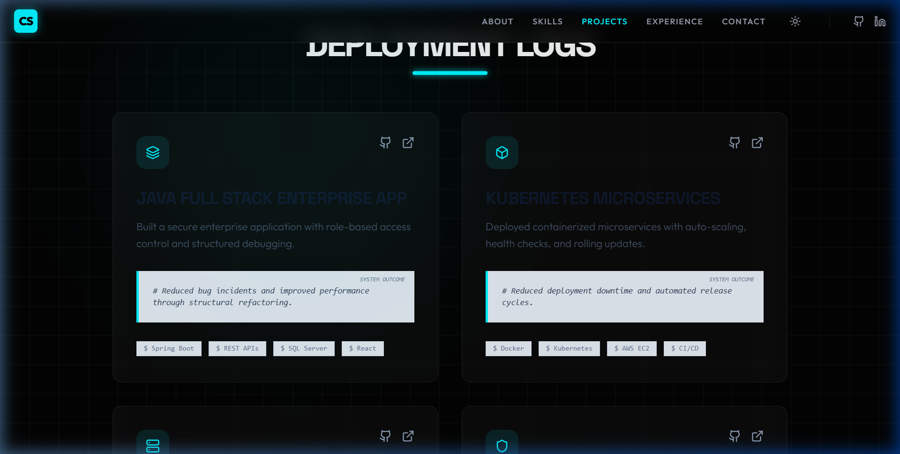

# Sachin C S - Professional Portfolio


A premium, interactive 3D portfolio showcasing my expertise as a Full Stack Developer and DevOps Architect. Built with React, Tailwind CSS, Framer Motion, and Three.js, this portfolio is designed to be highly engaging, performant, and fully responsive.

## 🚀 Live Demo

[View Live Portfolio](https://01Sachinc.github.io/sachin-portfolio/)

## ✨ Key Features

- **DevOps Aesthetic**: A unique terminal-inspired hero section, "syncing node" scroll loader, and git-commit style professional timeline.
- **Premium Glassmorphism**: High-quality transparent, frosted glass cards using modern CSS `backdrop-filter`.
- **Advanced Animations**: Fluid character dropping, staggered terminal typing, and scroll-triggered section entrances using `framer-motion` and `gsap`.
- **Dual Themes**: Complete, meticulously crafted Dark and Light modes engineered for optimal readability and contrast.
- **3D Elements**: Interactive cursor glow and dynamic background elements utilizing `@react-three/fiber` and `@react-three/drei`.
- **Functional Contact Form**: Integrated with EmailJS for seamless, direct messaging with visual state feedback.

## 💻 Tech Stack

- **Frontend**: React 19, Vite
- **Styling**: Tailwind CSS v4, Custom CSS variables for themeing
- **Animation**: Framer Motion, GSAP, ScrollTrigger
- **3D Graphics**: Three.js, React Three Fiber
- **Icons**: Lucide React
- **Deployment**: GitHub Pages
- **Integrations**: EmailJS (Contact Form)

## 📸 Gallery

### Dark Theme vs. Light Theme
*Engineered for perfection in any lighting environment.*

| Dark Mode | Light Mode |
| :---: | :---: |
|  |  |

## 🛠️ Local Development

1. **Clone the repository:**
   ```bash
   git clone https://github.com/01Sachinc/sachin-portfolio.git
   cd sachin-portfolio
   ```

2. **Install dependencies:**
   ```bash
   npm install
   ```

3. **Set up EmailJS (Optional):**
   - Head over to `src/components/Contact.jsx`
   - Replace the `YOUR_TEMPLATE_ID` and `YOUR_PUBLIC_KEY` placeholders with your actual EmailJS credentials.

4. **Start the development server:**
   ```bash
   npm run dev
   ```

## 📦 Deployment

This project is configured to deploy to GitHub pages automatically via the `gh-pages` branch.

```bash
npm run deploy
```

## 📄 License

This project is open-source and available under the [MIT License](LICENSE).

---
*Designed & Built by Sachin C S*
